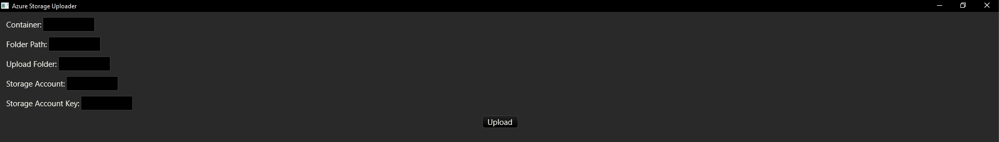

# Rust blob uploader with GUI for Azure Storage

## Blazing fast Azure Storage Blob uploader for Rust with Druid GUI

### How it works

This is a simple Rust application that allows you to upload files to Azure Storage Blob. It uses the Azure SDK for 
Rust to upload files to Azure Storage Blob. The application is built with Druid, a Rust-native GUI toolkit.

Files are loaded using rayon, a data parallelism library for Rust.

Then, the files are uploaded to Azure Storage Blob using the Azure SDK for Rust. The application uses the tokio runtime
to upload files concurrently, which makes the upload process faster.

### How to use

1. Pass in your Container name, Folder path, Upload Folder, Storage Account name, and Storage Account key in the respective fields.
2. Click on the "Upload" button to upload the file to Azure Storage Blob.

- Container name: The name of the container in Azure Storage Blob where you want to upload the files.

- Folder path: The path of the folder where the files are located. For example, if the files are located in the "C:\Users\username\Documents" folder,
then the folder path should be "C:\Users\username\Documents".

``Note: if `Recursive Upload` is checked, nested folders will be uploaded as well``

- Upload Folder: The folder in Azure Storage Blob where you want to upload the files. For example, 
if you want to upload the files to the "uploads" folder in the container, then set the upload folder to "uploads", it 
will be created if it doesn't exist.

- Storage Account name: The name of the Azure Storage Account where you want to upload the files.

- Storage Account key: The access key of the Azure Storage Account. You can get the access key from the Azure Portal by 
navigating to the `Storage Account` -> `Access keys`.

- Recursive Upload: If checked, the application will upload all files in the folder and its subfolders.
If unchecked, only the files in the selected folder will be uploaded.

### Performance

The app takes 1 second to upload some test files to azure, these are image files of different sizes being organized in the following schema:
26 images in the parent folder, 26 images in a subfolder, and 7 image in another subfolder, totaling 59 images and 60MB of data.